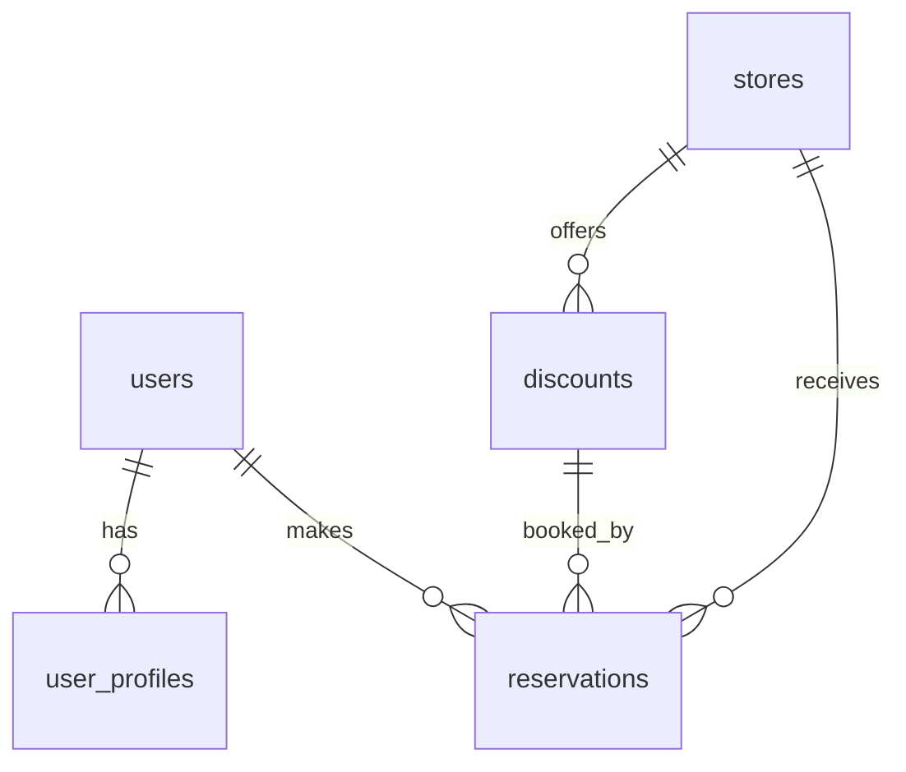

# ERD: 소셜 로그인 기반 할인 예약 플랫폼

---

## 1. 테이블 구조

### 1.1 users (사용자 정보)
| 컬럼명         | 타입           | 제약조건           | 설명                         |
| -------------- | -------------- | ------------------ | ---------------------------- |
| id             | uuid           | PK, NOT NULL       | 사용자 고유 ID (UUID)        |
| provider       | varchar(20)    | NOT NULL           | 소셜 로그인 제공자 (kakao/naver) |
| provider_id    | varchar(100)   | NOT NULL, UNIQUE   | 소셜 제공자별 유저 식별자    |
| email          | varchar(100)   |                    | 이메일 (선택)                |
| created_at     | timestamptz    | NOT NULL, DEFAULT now() | 가입일자                |

> [기능] 소셜 로그인 시 신규 row 생성 또는 provider_id로 조회

---

### 1.2 user_profiles (마이페이지 정보)
| 컬럼명     | 타입         | 제약조건           | 설명                       |
| ---------- | ------------ | ------------------ | -------------------------- |
| user_id    | uuid         | PK, FK(users.id)   | users 테이블 참조          |
| name       | varchar(50)  |                    | 사용자 이름                |
| phone      | varchar(20)  |                    | 연락처                     |
| birthday   | date         |                    | 생년월일                   |
| updated_at | timestamptz  | DEFAULT now()      | 정보 수정일                |

> [기능] 마이페이지 정보 수정 시 갱신

---

### 1.3 stores (가게 정보)
| 컬럼명     | 타입         | 제약조건           | 설명                       |
| ---------- | ------------ | ------------------ | -------------------------- |
| id         | uuid         | PK, NOT NULL       | 가게 고유 ID               |
| name       | varchar(100) | NOT NULL           | 가게명                     |
| address    | varchar(200) | NOT NULL           | 주소                       |
| lat        | float8       | NOT NULL           | 위도                       |
| lng        | float8       | NOT NULL           | 경도                       |
| phone      | varchar(20)  |                    | 가게 연락처                |
| created_at | timestamptz  | NOT NULL, DEFAULT now() | 등록일자                |
| activated  | boolean      | NOT NULL, DEFAULT false | 활성화 여부 (지도 표시) |

> [기능] 가게 등록/수정 시 row 생성/갱신

---

### 1.4 discounts (할인 정보)
| 컬럼명      | 타입         | 제약조건           | 설명                       |
| ----------- | ------------ | ------------------ | -------------------------- |
| id          | uuid         | PK, NOT NULL       | 할인 고유 ID               |
| store_id    | uuid         | FK(stores.id)      | 할인 적용 가게             |
| service     | varchar(100) | NOT NULL           | 할인 서비스명              |
| discount_rate | int         | NOT NULL           | 할인율 (%)                 |
| start_time  | timestamptz  | NOT NULL           | 할인 시작 시간             |
| end_time    | timestamptz  | NOT NULL           | 할인 종료 시간             |
| quantity    | int          | NOT NULL           | 남은 할인 수량             |
| created_at  | timestamptz  | NOT NULL, DEFAULT now() | 등록일자                |

> [기능] 가게 상세/홈/지도에서 할인 정보 노출, 할인 등록/수정 시 row 생성/갱신

---

### 1.5 reservations (예약 정보)
| 컬럼명      | 타입         | 제약조건           | 설명                       |
| ----------- | ------------ | ------------------ | -------------------------- |
| id          | uuid         | PK, NOT NULL       | 예약 고유 ID               |
| user_id     | uuid         | FK(users.id)       | 예약자                     |
| discount_id | uuid         | FK(discounts.id)   | 예약한 할인                |
| reserved_at | timestamptz  | NOT NULL, DEFAULT now() | 예약 시각                |
| status      | varchar(20)  | NOT NULL, DEFAULT 'active' | 예약 상태 (active/cancelled/used) |

> [기능] 예약 생성/취소/사용 시 row 생성/상태 변경, 마이페이지/예약내역에서 조회

---

## 2. 테이블 간 관계 요약

| 테이블1        | 관계   | 테이블2        | 설명                                 |
| -------------- | ------ | -------------- | ------------------------------------ |
| users          | 1:1    | user_profiles  | 한 명의 유저는 하나의 프로필 가짐   |
| users          | 1:N    | reservations   | 한 명의 유저는 여러 예약 가능        |
| stores         | 1:N    | discounts      | 한 가게는 여러 할인 등록 가능        |
| discounts      | 1:N    | reservations   | 한 할인은 여러 예약과 연결           |
| stores         | 1:N    | reservations   | (간접) 한 가게의 여러 예약 추적 가능 |

---

## 3. 기능별 테이블 영향 주석
- **소셜 로그인**: users, user_profiles
- **가게/서비스 탐색**: stores, discounts
- **예약 생성/확인/취소**: reservations, discounts(수량 감소)
- **마이페이지 정보 수정**: user_profiles

---

## 4. ERD 다이어그램 (관계 요약)

