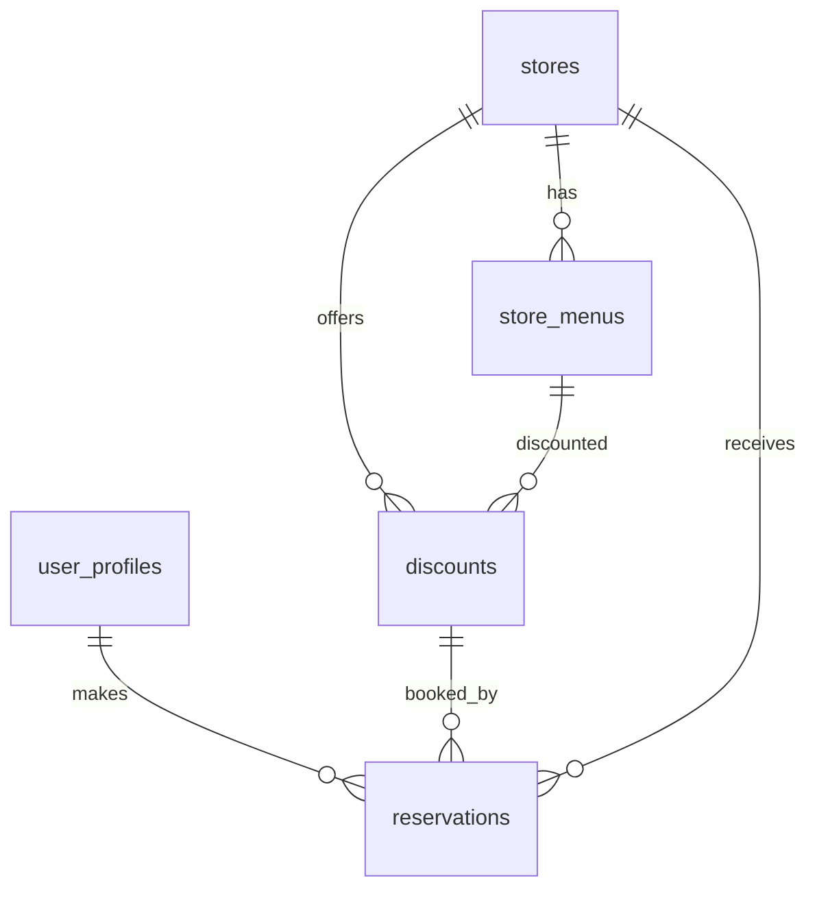

# ERD: 소셜 로그인 기반 할인 예약 플랫폼

---

## 1. 테이블 구조

### 1.1 user_profiles (사용자 정보)
| 컬럼명        | 타입           | 제약조건           | 설명                         |
| ------------- | -------------- | ------------------ | ---------------------------- |
| user_id       | uuid           | PK, FK(auth.users.id) | 사용자 고유 ID (UUID)        |
| email         | varchar        | NOT NULL           | 이메일                       |
| provider      | varchar        |                    | 소셜 로그인 제공자           |
| provider_id   | varchar        |                    | 소셜 제공자별 유저 식별자    |
| name          | varchar        |                    | 사용자 이름                  |
| phone_number  | varchar        |                    | 연락처                       |
| total_bookings| integer        | NOT NULL, DEFAULT 0| 총 예약 횟수                 |
| total_savings | bigint         | NOT NULL, DEFAULT 0| 총 할인 금액                 |
| created_at    | timestamptz    | NOT NULL, DEFAULT now() | 가입일자                |
| updated_at    | timestamptz    | NOT NULL, DEFAULT now() | 정보 수정일                |

> [기능] 소셜 로그인 시 신규 row 생성 또는 provider_id로 조회, 마이페이지 정보 수정 시 갱신

---

### 1.2 stores (가게 정보)
| 컬럼명     | 타입         | 제약조건           | 설명                       |
| ---------- | ------------ | ------------------ | -------------------------- |
| id         | uuid         | PK, NOT NULL       | 가게 고유 ID               |
| name       | varchar      | NOT NULL           | 가게명                     |
| address    | varchar      | NOT NULL           | 주소                       |
| lat        | float8       | NOT NULL           | 위도                       |
| lng        | float8       | NOT NULL           | 경도                       |
| phone      | varchar      |                    | 가게 연락처                |
| created_at | timestamptz  | NOT NULL, DEFAULT now() | 등록일자                |
| activated  | boolean      | NOT NULL, DEFAULT false | 활성화 여부 (지도 표시) |
| category   | varchar      | NOT NULL, DEFAULT '' | 업종/카테고리           |

> [기능] 가게 등록/수정 시 row 생성/갱신

---

### 1.3 store_menus (가게 메뉴 정보)
| 컬럼명     | 타입         | 제약조건           | 설명                       |
| ---------- | ------------ | ------------------ | -------------------------- |
| id         | uuid         | PK, NOT NULL, DEFAULT uuid_generate_v4() | 메뉴 고유 ID               |
| store_id   | uuid         | FK(stores.id), NOT NULL | 해당 가게 ID           |
| name       | varchar      | NOT NULL           | 메뉴명                     |
| price      | integer      | NOT NULL           | 메뉴 가격                  |
| thumbnail  | text         |                    | 메뉴 이미지 URL            |
| created_at | timestamptz  | DEFAULT now()      | 메뉴 등록일자              |

> [기능] 가게별 메뉴 관리, 할인 메뉴 지정 시 참조

---

### 1.4 discounts (할인 정보)
| 컬럼명         | 타입         | 제약조건           | 설명                       |
| -------------- | ------------ | ------------------ | -------------------------- |
| id             | uuid         | PK, NOT NULL, DEFAULT gen_random_uuid() | 할인 고유 ID               |
| store_id       | uuid         | FK(stores.id)      | 할인 적용 가게             |
| menu_id        | uuid         | FK(store_menus.id) | 할인 적용 메뉴             |
| discount_rate  | integer      | NOT NULL           | 할인율 (%)                 |
| start_time     | timestamptz  | NOT NULL           | 할인 시작 시간             |
| end_time       | timestamptz  | NOT NULL           | 할인 종료 시간             |
| quantity       | integer      |                    | 남은 할인 수량             |
| created_at     | timestamptz  | NOT NULL, DEFAULT now() | 등록일자                |

> [기능] 특정 메뉴에 대한 할인 등록/수정, 할인 수량 관리

---

### 1.5 reservations (예약 정보)
| 컬럼명      | 타입         | 제약조건           | 설명                       |
| ----------- | ------------ | ------------------ | -------------------------- |
| id          | uuid         | PK, NOT NULL, DEFAULT gen_random_uuid() | 예약 고유 ID               |
| user_id     | uuid         | FK(user_profiles.user_id) | 예약자                 |
| discount_id | uuid         | FK(discounts.id)   | 예약한 할인                |
| reserved_at | timestamptz  | NOT NULL, DEFAULT now() | 예약 시각                |
| status      | varchar      | NOT NULL, DEFAULT 'active' | 예약 상태 (active/cancelled/used) |

> [기능] 예약 생성/취소/사용 시 row 생성/상태 변경, 마이페이지/예약내역에서 조회

---

## 2. 테이블 간 관계 요약

| 테이블1        | 관계   | 테이블2        | 설명                                 |
| -------------- | ------ | -------------- | ------------------------------------ |
| user_profiles  | 1:N    | reservations   | 한 명의 유저는 여러 예약 가능        |
| stores         | 1:N    | store_menus    | 한 가게는 여러 메뉴 등록 가능        |
| stores         | 1:N    | discounts      | 한 가게는 여러 할인 등록 가능        |
| store_menus    | 1:N    | discounts      | 한 메뉴는 여러 할인 등록 가능        |
| discounts      | 1:N    | reservations   | 한 할인은 여러 예약과 연결           |
| stores         | 1:N    | reservations   | (간접) 한 가게의 여러 예약 추적 가능 |

---

## 3. 기능별 테이블 영향 주석
- **소셜 로그인**: user_profiles
- **가게/서비스 탐색**: stores, store_menus, discounts
- **예약 생성/확인/취소**: reservations, discounts(수량 감소)
- **마이페이지 정보 수정**: user_profiles

---

## 4. ERD 다이어그램 (관계 요약)

